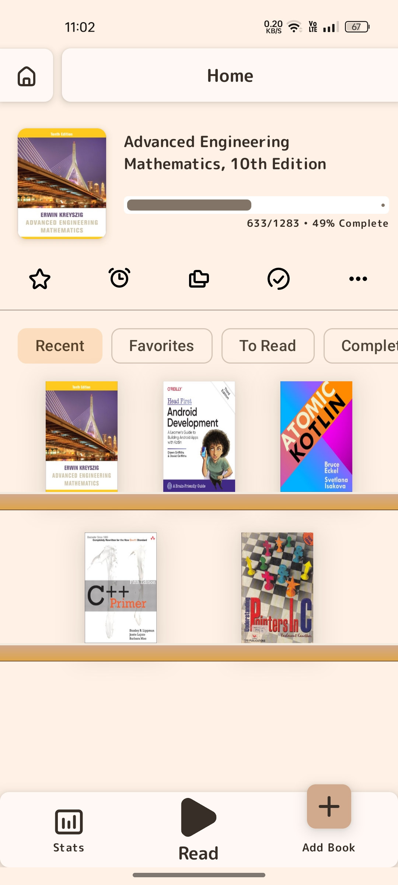
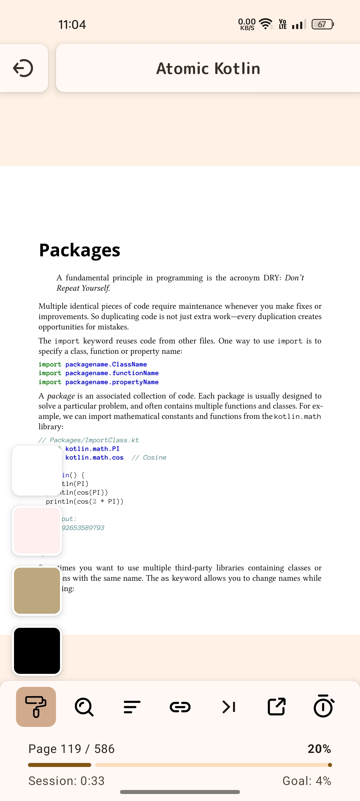
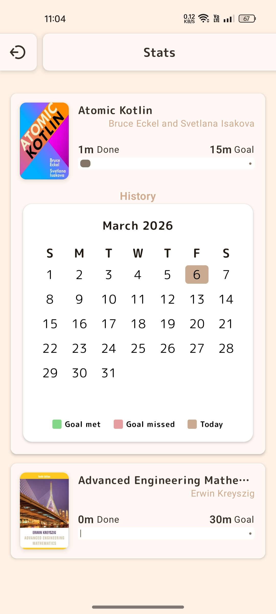

# 📚 Android PDF Book Reader

A modern **Android PDF reading application** designed for focused reading and personal reading goals.
The app provides a clean reading experience, customizable themes, and tools to help you build a consistent reading habit.

---

## ✨ Features

### ⏱ Daily Reading Goal (Per Book)

Set a **daily reading time goal for each book**.
Track how much time you spend reading and stay consistent with your reading habits.

* Set different goals for different books
* Track daily progress
* Build a consistent reading routine

---

### 🎨 Multiple Reading Themes

Choose the theme that feels most comfortable for long reading sessions.

Available themes include:

* **Light Mode** – Classic white reading experience
* **Sepia Mode** – Warm paper-like reading
* **Dark Mode** – Comfortable reading at night
* **Dark Sepia** – Reduced eye strain for low light environments

---

### 📚 Easy-to-Manage Book Library

Organize your books in a clean and simple library.

* Quickly add PDF books from your device
* Maintain a structured personal library
* Easily access recently opened books
* Smooth navigation between books

---

### 📊 Reading Statistics

Track how much time you spend reading.

* Daily reading time
* Per-book reading time
* Reading progress tracking

---

### 📖 Clean Reading Experience

The reader is designed to stay out of your way so you can focus on reading.

* Minimal UI
* Smooth PDF rendering
* Fast navigation between pages

---

## 📱 Screenshots

  
  
  

## 🛠 Built With

* **Kotlin**
* **Android Jetpack**
* **Jetpack Compose**
* **MVVM Architecture**

---

## 📂 Project Goals

This project aims to create a **simple, focused, and distraction-free reading app** with useful productivity features for readers.

---

## 📜 License

This project uses MuPDF for PDF rendering.

MuPDF is licensed under the GNU Affero General Public License (AGPL) v3.

Therefore this application is also distributed under the AGPL-3.0 license.

---

## 🤝 Contributions

Contributions, suggestions, and improvements are welcome.
Feel free to open an issue or submit a pull request.

---

## ⭐ Support

If you like the project, consider giving it a **star on GitHub** to support development.
